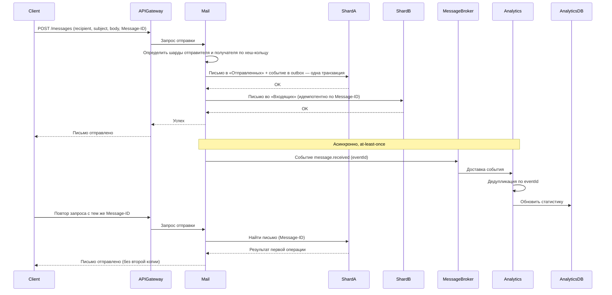
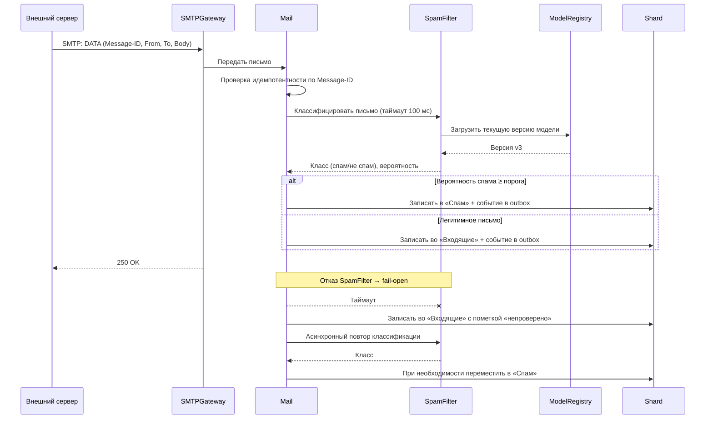
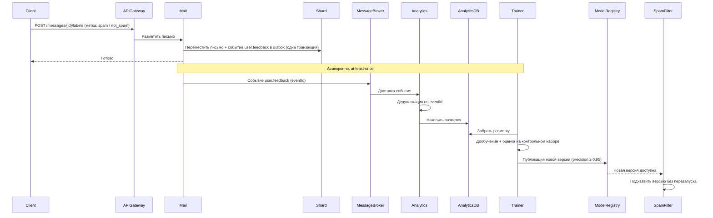
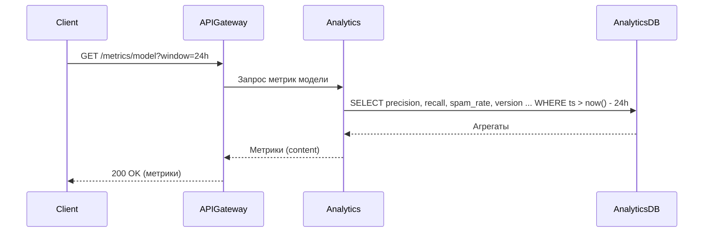
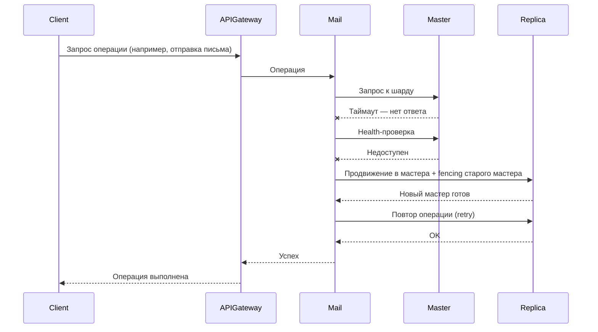
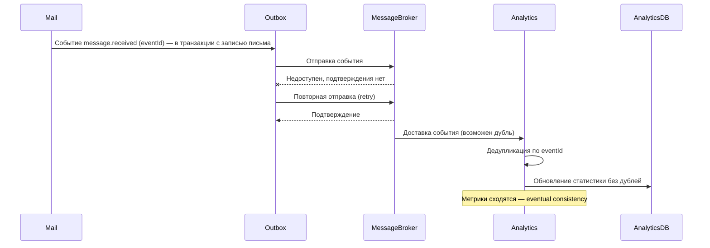

# Техническое решение проекта «Почтовый сервер с защитой от спама»

## Введение

- **Краткое описание:**  
  «Почтовый сервер с защитой от спама» — учебный проект, реализующий прототип распределённой почтовой системы с ML-классификацией входящих писем. Система позволяет отправлять и получать письма по протоколу SMTP, читать почту через веб-интерфейс, автоматически отделять спам от легитимных писем с помощью ML-модели и наблюдать качество модели через панель метрик. Обратная связь пользователей («спам» / «не спам») используется для периодического переобучения модели. Проект демонстрирует ключевые принципы построения отказоустойчивых и масштабируемых распределённых приложений.

- **Цель проекта:**  
  реализовать прототип распределённой почтовой системы, которая доставляет письма пользователям и автоматически фильтрует спам с помощью ML-модели.

- **Задачи:**  
  закрепить теоретические основы распределённых систем (масштабируемость, отказоустойчивость, консистентность) через практическую реализацию; продемонстрировать применение концепций курса: ненадёжная доставка сообщений, частичные отказы, распределение данных и нагрузки, модели согласованности, а также интеграцию ML-модели в распределённый конвейер обработки данных.

- **Состав команды:**  
  Иванов Кирилл(Тимлид, ML-инженер), Шестаков Алексей(Разработчик, тестировщик), Дозмолин Никита(Разработчик), Дегтярев Евгений (Тестировщик)

---

## Глоссарий
| Термин        | Определение |
|---------------|-------------|
| Почтовый ящик | Учётная запись пользователя, хранящая входящие и исходящие письма. |
| Письмо        | Сообщение с заголовками (From, To, Subject, Message-ID) и телом; единица хранения и доставки. |
| Message-ID    | Уникальный идентификатор письма, назначаемый при отправке; ключ дедупликации и идемпотентности. |
| SMTP          | Протокол передачи почты между серверами (RFC 5321) и от клиента к серверу. |
| MX-запись     | DNS-запись, указывающая, какой сервер принимает почту для домена. |
| Папка         | Логическое хранилище писем в ящике: «Входящие», «Спам», «Отправленные», «Корзина». |
| Спам         | Нежелательная массовая рассылка, которую система должна не доставлять в «Входящие». |
| ML-модель     | Классификатор текста писем (спам / не спам), используемый для фильтрации. |
| Инференс      | Процесс применения обученной модели к новому письму для получения предсказания. |
| Обратная связь | Действие пользователя «пометить как спам» / «не спам» — разметка для переобучения. |
| Precision / Recall | Метрики качества классификатора: доля предсказанного спама, который реально спам, и доля реального спама, который модель нашла. |
| Model Registry | Хранилище версий обученных моделей; инференс работает с опубликованной версией. |
| API Gateway   | Точка входа для всех клиентских запросов веб-интерфейса. |
| Шард          | Независимый сегмент данных, размещённый на отдельном узле или группе узлов. |
| Хеш-кольцо    | Способ распределения ключей по узлам (consistent hashing): узлы и ключи отображаются хеш-функцией на кольцо, ключ принадлежит ближайшему узлу по часовой стрелке. |
| Виртуальный узел | Дополнительная точка хеш-кольца, принадлежащая физическому узлу; повышает равномерность распределения ключей. |
| Мастер        | Реплика, принимающая записи в пределах своего шарда. |
| Failover      | Автоматическое переключение на резервный узел при отказе основного. |
| Fencing       | Изоляция отказавшего мастера, исключающая его дальнейшие записи (защита от split-brain). |
| Идемпотентность | Свойство операции: повторное выполнение с теми же параметрами не изменяет результат — эффект применяется один раз. |
| At-least-once | Семантика доставки сообщений: сообщение доставляется как минимум один раз, возможны дубли. |
| Transactional outbox | Паттерн: событие записывается в outbox-таблицу в той же транзакции, что и изменение данных, затем пересылается в брокер с повторами. |
| Дедупликация  | Отбрасывание повторно доставленных сообщений по идентификатору (Message-ID события). |
| Eventual consistency | Модель согласованности: при отсутствии новых обновлений все копии данных со временем сходятся к одному состоянию. |
| Fail-open     | Поведение системы при отказе ML-сервиса: письмо доставляется без классификации (помечается «непроверено»), фильтрация не блокирует почту. |

---

## Функциональные требования
Система должна предоставлять следующие функции:
1. Отправка писем пользователям внутри системы и на внешние почтовые домены по SMTP.  
2. Приём входящих писем по SMTP от внешних серверов и от внутренних пользователей.  
3. Просмотр и управление почтой через веб-интерфейс: папки «Входящие», «Спам», «Отправленные», «Корзина», чтение писем, удаление и перемещение.  
4. Автоматическая ML-классификация каждого входящего письма с перемещением спама в папку «Спам».  
5. Разметка писем пользователем («пометить как спам» / «не спам») с последующим использованием разметки для переобучения модели.  
6. Панель метрик ML-модели: precision, recall, доля спама в потоке, распределение предсказаний, качество по версиям модели.  

### Ограничения на предметную область

1. Почта работает только в пределах одного домена (например, `mail.example`); доставка на внешние домены выполняется по стандартному SMTP, но приём от внешних серверов не аутентифицируется через SPF/DKIM/DMARC — эти проверки вне объёма проекта.
2. Поддерживаются только текстовые письма и вложения размером не более 20 МБ.
3. Модель классифицирует только заголовок и текст письма; вложения не анализируются.
4. Пользовательские ящики создаются администратором, самообслуживающая регистрация вне объёма проекта.

---

## Нефункциональные требования
- **Доступность:** 99.9%.  
- **Масштабируемость:** возможность увеличения числа узлов Mail DB без модификации логики; при добавлении или удалении узла перемещается только диапазон ключей соседних сегментов хеш-кольца; инстансы SMTP Gateway и Mail масштабируются горизонтально.  
- **Время отклика:** ≤ 200 мс для операций веб-интерфейса в условиях локальной сети; классификация письма ≤ 100 мс (95-й перцентиль).  
- **Пропускная способность приёма:** обработка ≥ 100 писем/сек на инстанс SMTP Gateway.  
- **Отказоустойчивость:** система должна продолжать работать при сбое одного из узлов: недоступность обнаруживается по таймаутам и health-проверкам; при отказе мастера шарда система сама переключается на доступную реплику (failover); при отказе ML-сервиса почта продолжает доставляться (fail-open).  
- **Доставка событий:** семантика at-least-once; повторная доставка события не приводит к его повторной обработке (идемпотентность потребителя).  
- **Консистентность:** письмо не доставляется дважды при повторных SMTP-сессиях и повторных доставках событий (дедупликация по Message-ID); при отсутствии новых операций папки и метрики сходятся к полному состоянию (eventual consistency).  
- **Качество классификации:** precision ≥ 0.95 на контрольном наборе; ложные срабатывания (legit в спаме) ≤ 2%.  

---

## Пользовательские сценарии

### Сценарий: отправка письма внутри системы

1. Клиент отправляет в API Gateway запрос POST /messages с параметрами: recipient, subject, body и идемпотентный ключ (Message-ID, генерируется клиентом).
2. API Gateway перенаправляет запрос в сервис Mail.
3. Инстанс Mail по локальной копии хеш-кольца определяет шарды отправителя и получателя (хеш от userId).
4. В одной транзакции на шарде отправителя письмо записывается в папку «Отправленных», на шарде получателя — в папку «Входящих» (за исключением внешнего получателя — тогда исходящая очередь), и в outbox-таблицу записывается событие message.received.
5. Mail сообщает API Gateway об успешной отправке, API Gateway возвращает клиенту ответ.
6. Асинхронно: событие из outbox пересылается в Message Broker (at-least-once); Analytics дедуплицирует его по eventId и обновляет Analytics DB.
7. Повторный запрос с тем же Message-ID: Mail находит существующее письмо и возвращает результат первой операции без второй копии.

### Сценарий: приём входящего письма и классификация спама

1. Внешний почтовый сервер отправляет письмо по SMTP на SMTP Gateway (MX-запись домена).
2. SMTP Gateway передаёт письмо в сервис Mail; Mail проверяет Message-ID на идемпотентность.
3. Mail вызывает SpamFilter с таймаутом 100 мс; SpamFilter выполняет инференс опубликованной моделью из Model Registry и возвращает класс и вероятность.
4. Если вероятность спама выше порога — письмо записывается в папку «Спам», иначе — во «Входящие»; в той же транзакции в outbox пишется событие message.classified.
5. Если SpamFilter не ответил за таймаут — письмо доставляется во «Входящие» с пометкой «непроверено» (fail-open), а асинхронный повтор классификации при результате перемещает письмо в «Спам».
6. SMTP Gateway отвечает внешнему серверу 250 OK — письмо принято.

### Сценарий: обратная связь пользователя и переобучение модели

1. Пользователь открывает письмо в папке «Спам» и нажимает «Не спам» (или наоборот — «Спам» во «Входящих»).
2. Клиент отправляет в API Gateway запрос POST /messages/{messageId}/labels с меткой.
3. API Gateway перенаправляет запрос в Mail; Mail перемещает письмо в нужную папку и в одной транзакции записывает событие user.feedback в outbox.
4. Событие доставляется в Message Broker (at-least-once), Analytics дедуплицирует его по eventId и накапливает разметку в Analytics DB.
5. По расписанию Trainer забирает разметку из Analytics DB, дообучает модель и оценивает её на контрольном наборе.
6. Если метрики прошли приёмку (precision ≥ 0.95) — Trainer публикует версию в Model Registry; SpamFilter подхватывает её без перезапуска.

### Сценарий: просмотр панели метрик ML-модели

1. Пользователь открывает страницу метрик, отправляя GET /metrics/model?window=24h.
2. API Gateway перенаправляет запрос в сервис Analytics.
3. Analytics выполняет агрегирующие запросы к Analytics DB: precision/recall за окно, долю спама во входящем потоке, распределение предсказаний по версиям модели.
4. API Gateway возвращает клиенту ответ со списком метрик.

### Сценарий: отказ мастера шарда

1. Во время обработки запросов мастер одного из шардов Mail DB перестаёт отвечать.
2. Инстанс Mail не получает ответ в течение таймаута и проверяет узел health-запросом; мастер недоступен.
3. Система продвигает реплику шарда в новый мастер и изолирует старый мастер (fencing), исключающий его записи.
4. Инстанс Mail повторяет операцию к новому мастеру (retry).
5. Клиентская операция завершается успешно; задержка ограничена временем детекции и переключения.

### Сценарий: потеря и повторная доставка события

1. После доставки письма событие message.received записано в outbox-таблицу шарда.
2. Message Broker временно недоступен — отправка события не подтверждается.
3. Отправитель outbox повторяет отправку до подтверждения — семантика at-least-once.
4. В результате брокер может доставить событие в Analytics более одного раза.
5. Analytics распознаёт повтор по eventId (дедупликация) и отбрасывает дубликат.
6. Метрики сходятся к полному состоянию без дублей — eventual consistency.

---

## Архитектура системы

//TODO

---

## Технические сценарии

//TODO

---

## План разработки и тестирования

//TODO
